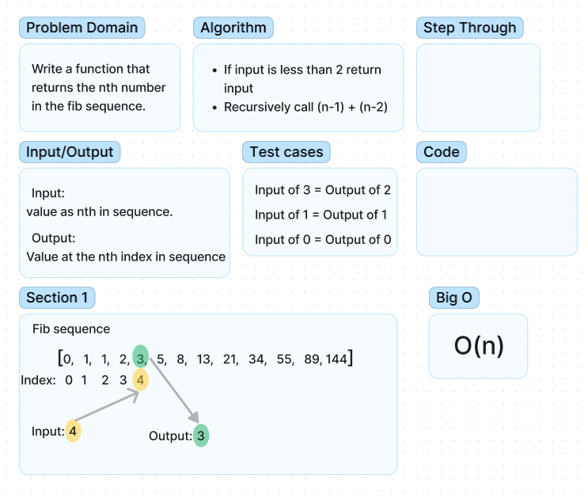

## Whiteboard Process

## Approach & Efficiency

I was not able to pair for this mock interview so I did this whiteboard on my own i chose to do the fibonaci sequence question which proved to be quite difficult for me. I did not make it to the code within the time limit. I feel like I spent to much time trying to understand the problem and had to look at the solution in the end. I also need to practice with figma so i dont waste time trying to get everything on the whiteboard. I also could nootthink of any useful clarifying questions for this specific problem.  
