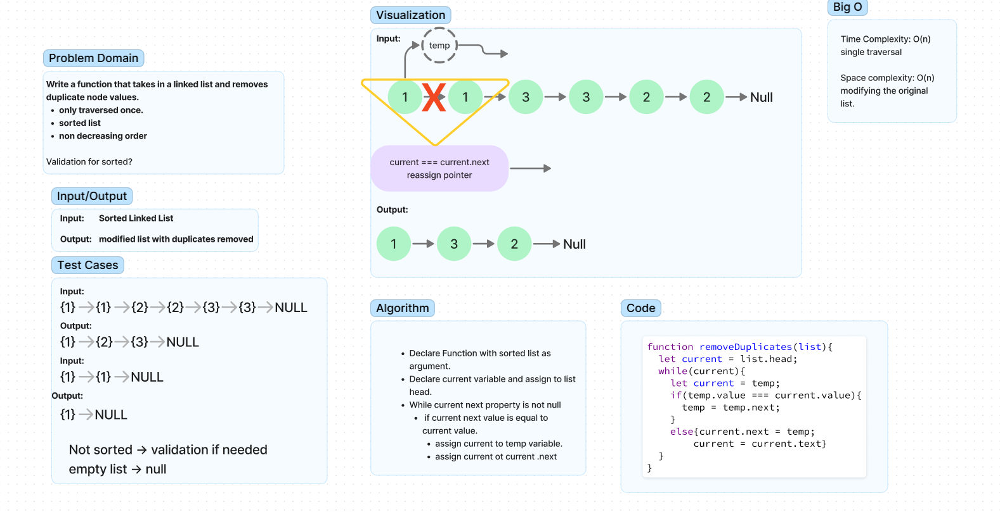

# Reapeted Words 

Write a function that takes in a linked list and removes duplicate node values.  

- only traversed once.
- sorted list.  
- non decreasing order.  

Validation for sorted?

## Whiteboard Process

## Approach & Efficiency

Iterated over the list and compared values of a temp variable and current. next to remover duplicates.  

## Solution

Function to be exported.  

## Collaboration/Resouces

- Used challenge from geeks for geeks.

## Notes