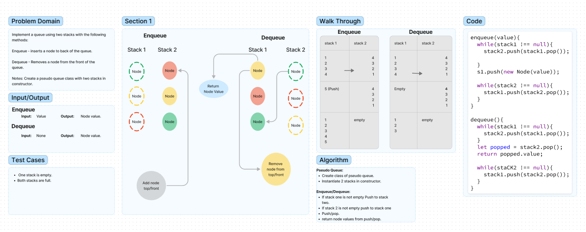

 # Code Challenge 10(Stacks and Queues)

Write functions to enqueue and dequeue nodes.
Write a function to push and pop nodes on a stack.
Write a function that returns the value of the head node.
Write a function to return a boolean if the list is empty or not.

## Whiteboard Process

## Approach & Efficiency  

I chose to move the nodes back and forth from the two stacks in order to maintain first in first out.

**Enqueue:**

- Push the nodes of stack one to stack two.
- Push a new node to stack one with value given.
- Push nodes from stack two back into stack one.  

**Dequeue:**

- Push the nodes of stack one into stack two.
- Pop off and return the node value at the top of stack two.
- Push the remaining nodes back int op stack one

## Solution

Enqueue and dequeue methods on a pseudo queue class using a apir of stacks.  

## Collaborators

- Ryan Eastman
