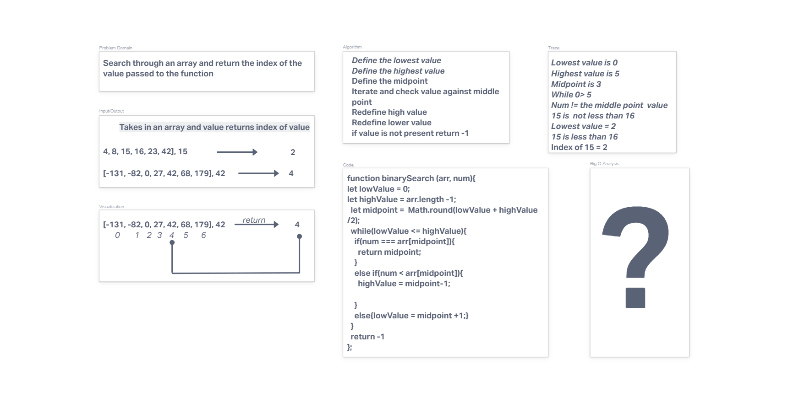

# Binary Search of Sorted Array

Write a function that takes in an array and value. Use binary search to find the index of the value in a sortred array or return -1 if value is not present.  

## Whiteboard Process

## Approach & Efficiency

Used if statements to narrow down searching for index in binary search format.  

## Resources

[Leigh Halliday Video](youtube.com/watch?v=7lGiPItOVCM)  
[Wiki link from directions](https://en.wikipedia.org/wiki/Binary_search_algorithm)  
