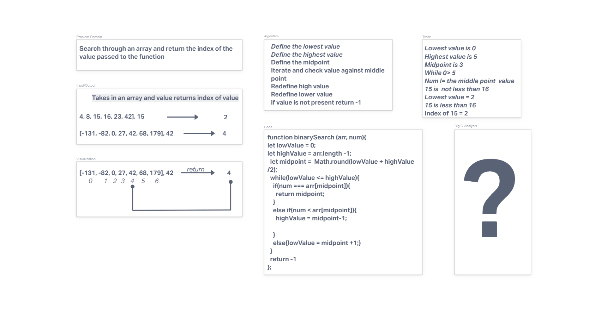

# Insert to Middle of an Array

Write a function that takes in an array and a value. The function should insert the value into the middle of the array.

## Whiteboard Process

## Approach & Efficiency

Colllaborated with Eva Grace Smith to iterate through the array assigning new indexes in a new array and adding the value given to the appropriate place.  

