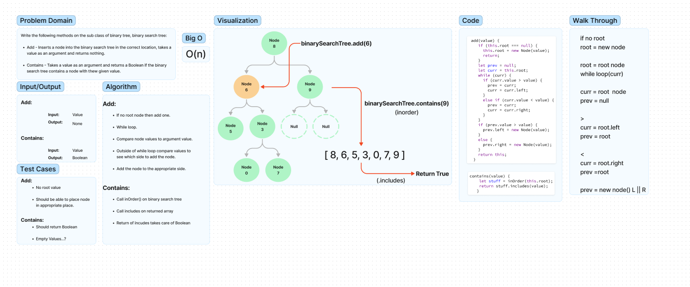

# Code Challenge 15 (Binary Search Tree Methods)

write the followong methods ofdn the sub class of binary tree, binary search tree.:  
**add:**  
A method that adds a node into the binarty search tree(in the correct location), takes a value as an argument and returns nothing.  

**Contains:**  
A method that takes a value as an argument anaad returns a boolean if the binary search tree contains a node with thew given value.  

## Whiteboard Process

## Approach & Efficiency

**Add:**

- Iterative solution with if statemenst comparing given argument with node values.

**Contains:**

- Used inorder() method from binary tree class to put all of the values into an array, then used the includes array method to return boolean if value was in array or not.  

## Solution

Method on the binary search tree class.  

### Collaboration/Credit

- Class demo code  
- This article was really helpful!
[geeksforgeeks](https://www.geeksforgeeks.org/binary-search-tree-set-1-search-and-insertion/)  
