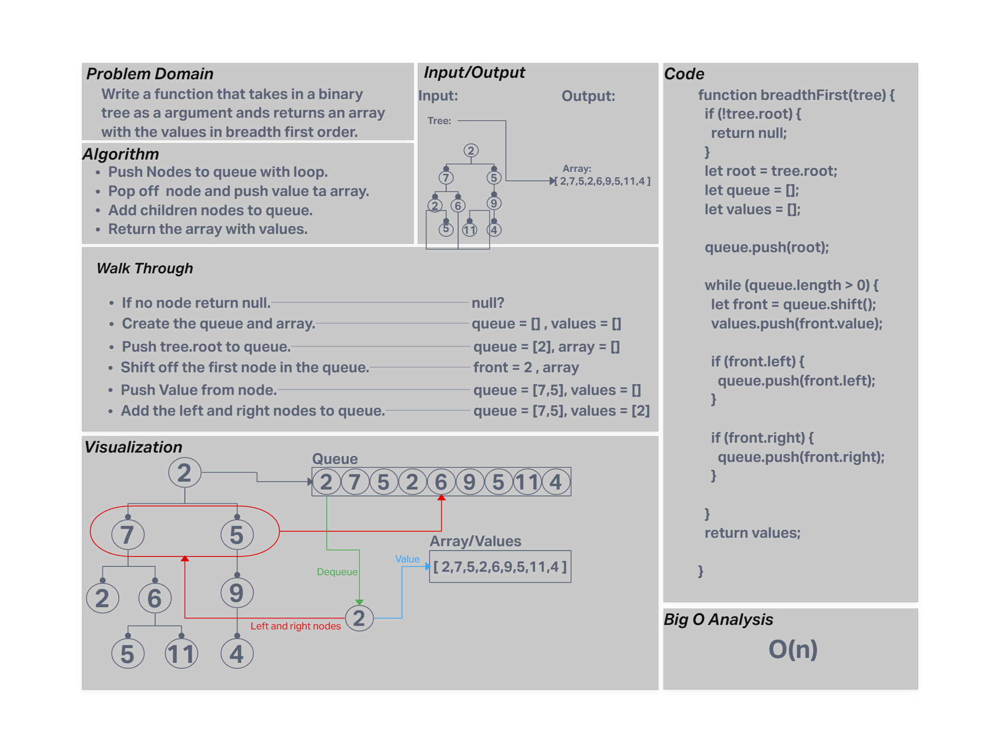

# Code Challenge 17 (Binary Tree Breadth First Traversal)

Write a function that takes in a tree and returns an array with the node values in breadth first order.  

## Whiteboard Process

## Approach & Efficiency

Pushed the nodes to a queue and on dequeue pushed the children nodes to the queue as well as the value to the array to be returned.  

## Solution

Function that uses breadth first traversal.  
