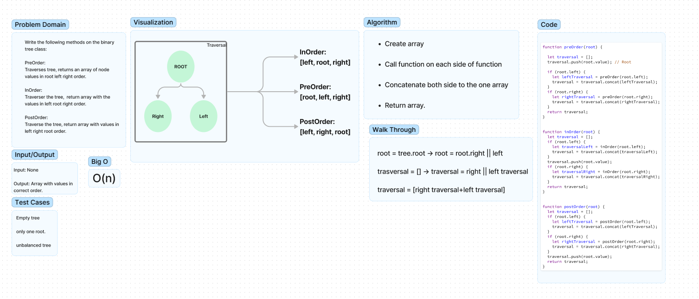

# Code Challenge 15 (Binary Tree Methods)

Write the Following Methods om the Binary Tree class preOrder(),  
**add:**  
A method that adds a node into the binarty search tree(in the correct location), takes a value as an argument and returns nothing.  

**Contains:**  
A method that takes a value as an argument anaad returns a boolean if the binary search tree contains a node with thew given value.  

## Whiteboard Process

## Approach & Efficiency

**PreOrder:**

- Used recursive function to trverse both sides of tree and put them in the correct order(Root Left Right).

**InOrder:**

- Used recursive function to trverse both sides of tree and put them in the correct order(Left Root Right).  

**PostOrder**

- Used recursive function to trverse both sides of tree and put them in the correct order(Left Right Root).

## Solution

Method on the binary search tree class.  

### Collaboration/Credit

- Class demo code  
