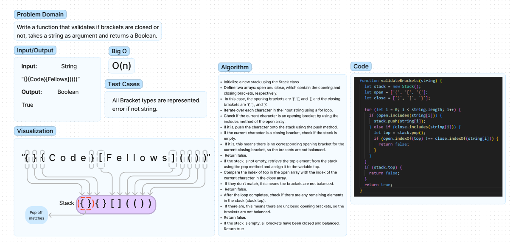

# Code Challenge 10(Stacks and Queues)  

Write a function that takes in a string and returns true or false if the brackets all match up.  

## Whiteboard Process

## Approach & Efficiency  

I chose to iterate over the length of the string and push the opening brackets to a stack that compares the matches and pops them off, if there is a stack.top return false if stack isd empty return true.

## Solution  

Function to match brackets.  

### Collaborators

- Ryan Eastman
- Chat GPT
