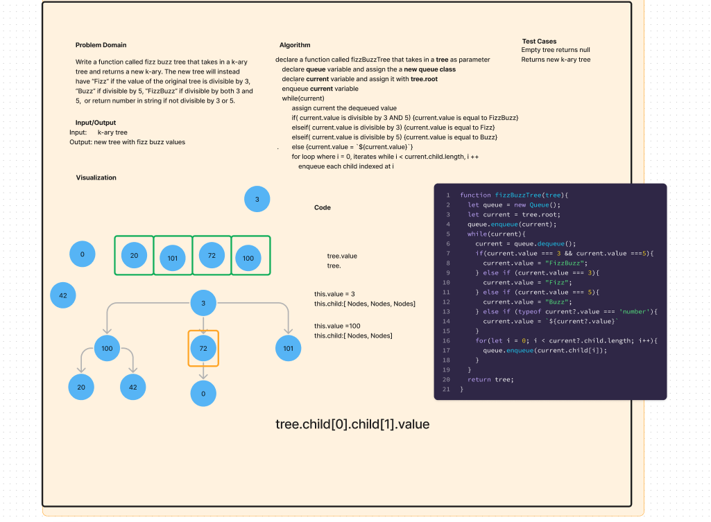

# Code Challenge 18 (FIzz Buzz K-ary Tree)
Write a function that takes in a k-ary tree and returns a new tree with:

If the value is divisible by 3, replace the value with “Fizz”
If the value is divisible by 5, replace the value with “Buzz”
If the value is divisible by 3 and 5, replace the value with “FizzBuzz”
If the value is not divisible by 3 or 5, simply turn the number into a String.  

## Whiteboard Process

## Approach & Efficiency

Traversed tree breadth first and used if statements to change node values and return the tree.  

## Solution

Function to fizz buzz tree.  

## Collaborators:

Francisco Sanchez
