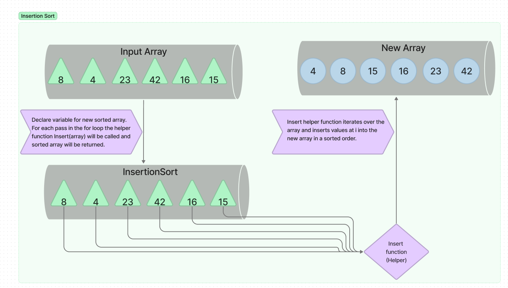
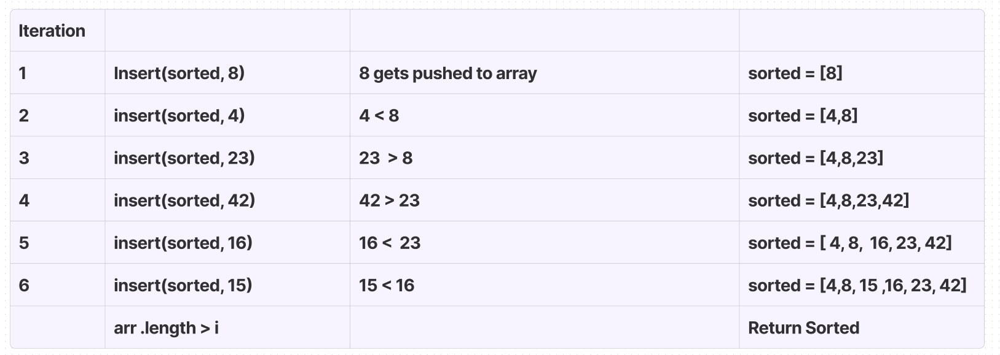

# Insertion Sort

## UML
  

## Psuedo Code 
Insert(int[] sorted, int value)  
  initialize i to 0  
  WHILE value > sorted[i]  
    set i to i + 1  
  WHILE i < sorted.length  
    set temp to sorted[i]  
    set sorted[i] to value  
    set value to temp  
    set i to i + 1  
  append value to sorted  

InsertionSort(int[] input)  
  LET sorted = New Empty Array  
  sorted[0] = input[0]  
  FOR i from 1 up to input.length  
    Insert(sorted, input[i])  
  return sorted  

## Walk Through

1. The array to be sorted is passed in to the insertionSort function, a new array is declared.The sorted array at index 0 is assigned to the input index at 0. then the insert helper function is called inside of the forloop.  

2. In the insert function the sorted array is passed as an argument and the input array at each index is passed as the other argument. A while loop is used to evaluate the previouse and current values to determine where the value should be placed. 

## Code

[Link to code](./index.js)
