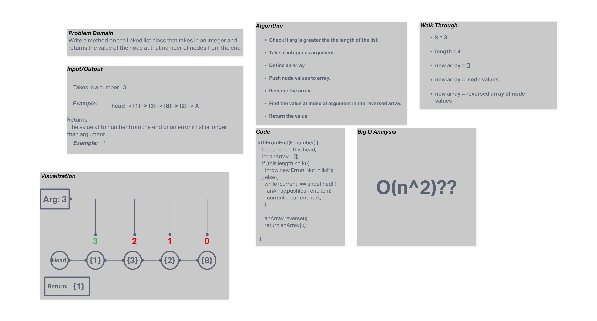

 # Code Challenge 07(Linked List Kth From End)

Write a method that takes in a number(k) and returns the value of the node this at numbers "index" from the end.

## Whiteboard Process

## Approach & Efficiency

I first checked the value of k against the length of the list and threw an error if the value was larger or equal to length of the list. I then iterated over the list and pushed the values to an array which I reversed and returned the valaue at the index of k. This probaby was not the most efficient way to do this.  

## Solution

Method on linked list class.  

    const list = new LinkedList<number>();

    list.insert(1);
    list.insert(2);
    list.insert(3);
    list.insert(4);

    list.kthFromTheEnd(1);

 returns: 3