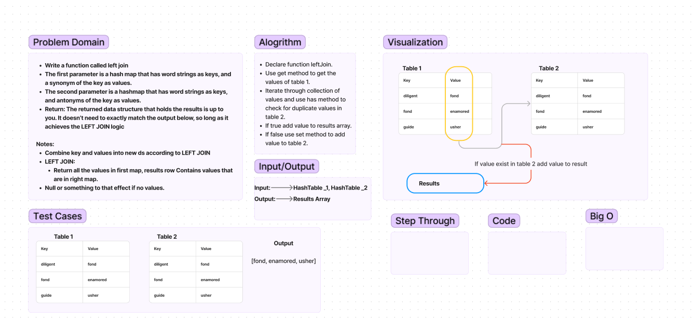

# Hash Map Left Join

Write a function called left join  
The first parameter is a hash map that has word strings as keys, and a synonym of the key as values.  
The second parameter is a hashmap that has word strings as keys, and antonyms of the key as values.  
Return: The returned data structure that holds the results is up to you. It doesn’t need to exactly match the   output below, so long as it achieves the LEFT JOIN logic  

Notes:  
Combine key and values into new ds according to LEFT JOIN  
LEFT JOIN:  
Return all the values in first map, results row Contains values that are in right map.  
Null or something to that effect if no values.  

## Whiteboard Process

## Approach & Efficiency

Planning on using the previously implemented methods on the hash table.  

## Solution

Function to be exported.  

## Collaboration/Resouces
 

## Notes

TODO:

- Tests  
- Code
- Finished UML
