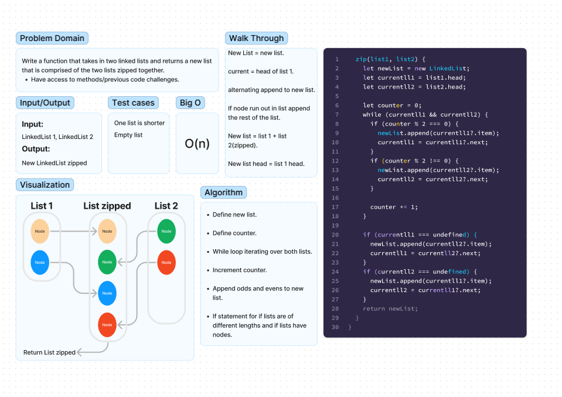

# Code Challenge 08 (Zip)

Write a function that takes in two Linked lists and returns a new list with the nodes zipped together.

## Whiteboard Process

## Code Challenge 05(Linked List Implementation)

Write a functiopn tthat takes in two linked lists and zips them together.
Returns a new linked list.

## Approach & Efficiency

Added a counter variable to check for evens and odds and appended the nodes from list 1 on the even counts and the nodes from list 2 on the odd count. then I checked for if the lists were longer and appended the rest of the remaining list.

## Solution

Method on the linked list class.
