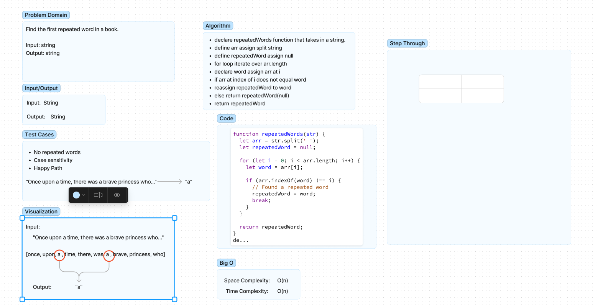

# Reapeted Words 

Write a finction that takes in a string and returns the first word that is repeated. 

## Whiteboard Process

## Approach & Efficiency

Chose to split the string into an array and iterate over the arrray to check for repeated words.  

## Solution

Function to be exported.  

## Collaboration/Resouces

- Emmanuel Gonzales  
- Kaeden O'Meara  

## Notes

- Still need testing.  
- Not sure if this is what the Challenge is asking for.  
