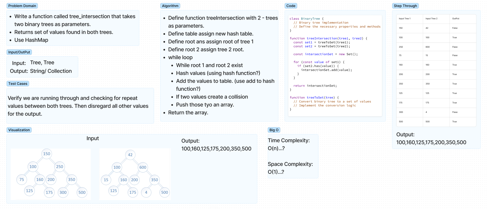

# Reapeted Words 

Write a function called tree_intersection that takes two binary trees as parameters and returns a collection of all odf the repeated values. use hash map.

## Whiteboard Process

## Approach & Efficiency

Chose to add the values of each tree to the hash table. and using the has method on the hash table class to check for duplicate values. If a value is duplicated it is then adding the value to another hash table.  

## Solution

Function to be exported.  

## Collaboration/Resouces

- Hayden Cooper  
- ChatGPT  

## Notes