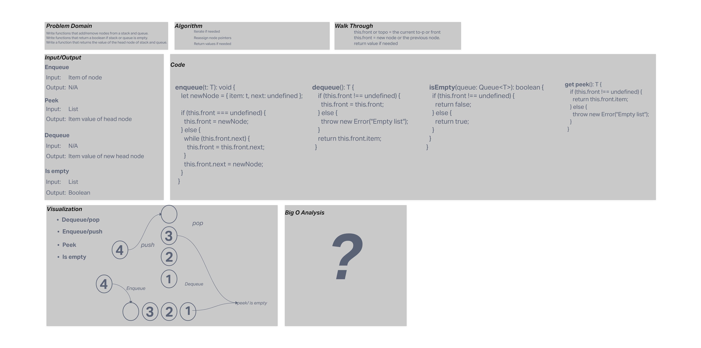

 # Code Challenge 10(Stacks and Queues)
Write functions to enqueue and dequeue nodes.
Write a function to push and pop nodes on a stack.
Write a function that returns the value of the head node.
Write a function to return a boolean if the list is empty or not.

## Whiteboard Process

## Approach & Efficiency
**Enqueue:**
I iterated to the end of the list and reassigned the next pointer to be a new node.   
**Dequeue:**
I reassigned the second node in the list to be the front of the list.  
**Peek:**
Returns the first item in either the front for a queue or the top node in the case of a stack.  
**IsEmpty:**
Uses if statement to determine if the front or top is defined and returns the appropriate boolean.  
**Push:**
I assigned a new node to be the top and pointed the next property to the previous node.  
**Pop:**
I reassigned the second node to be the top. 
## Solution
Methods on the stack and queue classes to add or remove nodes to stacks or queues.
Methods to view value of head node of stack or queue.
method to determine if stack or queue is empty. 
