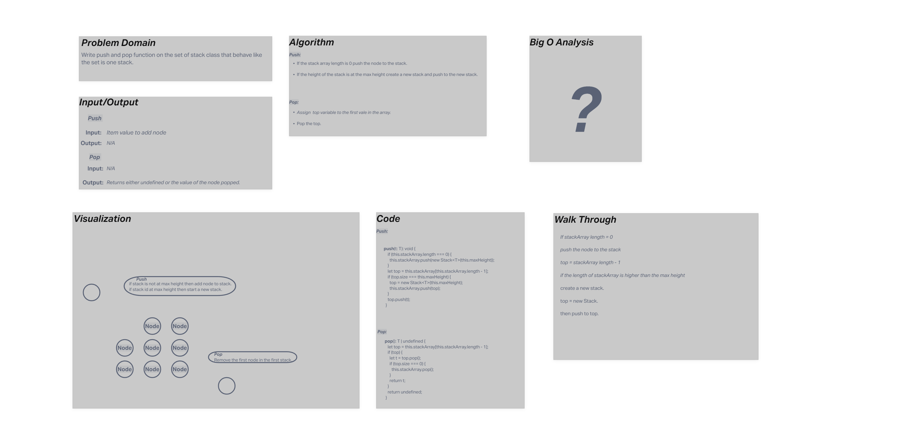

 # Code Challenge 10(Stacks and Queues)
Write functions to enqueue and dequeue nodes.
Write a function to push and pop nodes on a stack.
Write a function that returns the value of the head node.
Write a function to return a boolean if the list is empty or not.

## Whiteboard Process

## Approach & Efficiency 

I relied heavily on solution code from repo.

**Push:**
 if the length of the array is equal to the max height we create a new stack if is is not at maxheight thew nwe push to that stack. 
**Pop:**
we check to see if the last value in the array is a stack and pop the top of or pop the stack off if there is only the one value.

## Solution

Methods on the set of stacks class 

### Collaborators

- David Souther  
