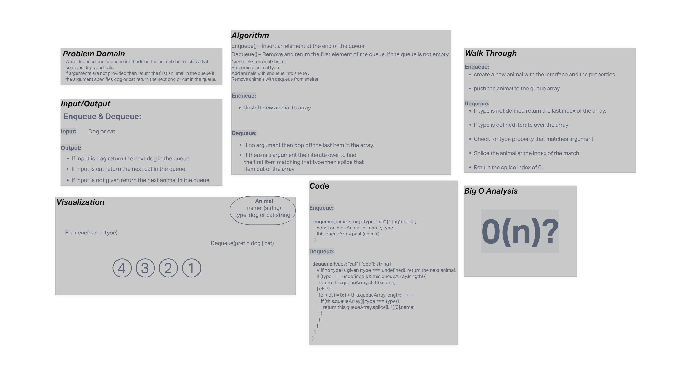

 # Code Challenge 10(Stacks and Queues)
Write dequeue and enqueue methods on the animal shelter class that contains dogs and cats.
If arguments are not provided then return the first aniumal in the queue if the argument specifies dog or cat return the next dog or cat in the queue. 

## Whiteboard Process

## Approach & Efficiency  

**Enqueue:**
I push the new animal object to the queue array.
**Dequeue:**
If the type was not specified I shifted off the first value in the array and returned it. If the type was specified I iterated throught the array to the first object with the type matching the one specified and spliced that out and returned the first value in that array.  

## Solution

Methods on the Animal shelter class.  

### Collaborators

- David Souther  
