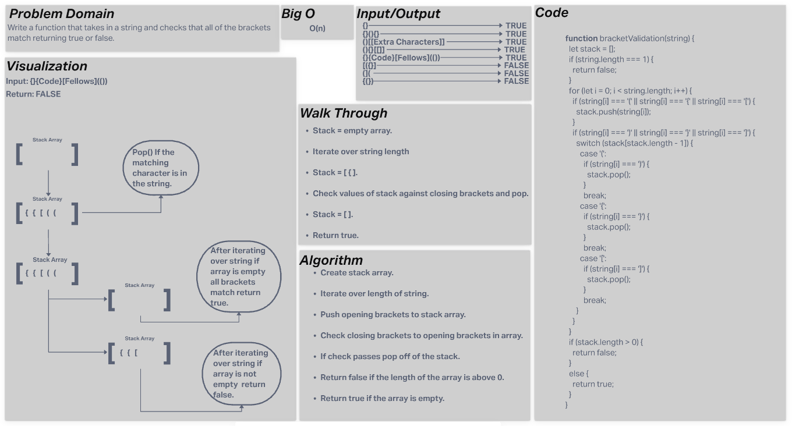

# Code Challenge 10(Stacks and Queues)  

Write a function that takes in a string and returns true or false if the brackets all match up.  

## Whiteboard Process

## Approach & Efficiency  

I chose to iterate over the length of the string and push the opening brackets to an array. I then used an if statement to target the closing brackets which I comapred to the stack arrays last value using a switch statement.  

## Solution  

Function to match brackets.  

### Collaborators

- David Souther  
